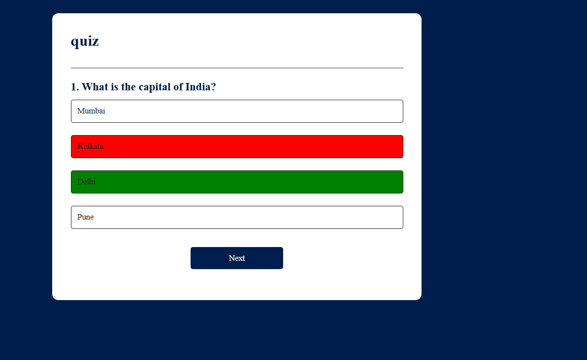

# 🧠 Quiz App

A simple and interactive **Quiz Application** built using **HTML, CSS, and JavaScript**.
This app displays multiple-choice questions, checks answers instantly, and shows the final score.

---

## 🚀 Features

* 📌 Multiple-choice questions
* ✅ Instant answer validation
* ➡️ Next question navigation
* 🔁 Restart quiz functionality
* 📊 Final score display

---

## 📸 Screenshot



---

## 🛠️ Tech Stack

* **HTML** – Structure
* **CSS** – Styling
* **JavaScript** – Logic & interactivity

---

## ▶️ How to Run

1. Clone the repository:

   ```bash
   git clone https://github.com/sanchitabanerjee304/simplequiz.git
   ```

2. Open the project folder

3. Run `index.html` in your browser

---

## 📂 Project Structure

```bash
simplequiz/
 ├── index.html
 ├── style.css
 ├── script.js
 ├── README.md
 └── quiz.png
```

---

## 💡 Future Improvements

* ⏱️ Add timer
* 📊 Add progress bar
* 🎨 Improve UI/UX
* 📱 Make fully responsive

---

## 👩‍💻 Author

**Sanchita Banerjee**

---

## ⭐ Support

If you like this project, give it a ⭐ on GitHub!
